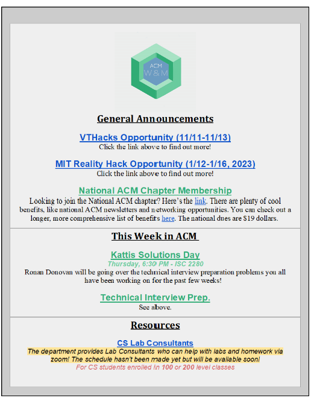

# **Fall 2023 Interest Meeting**
### William & Mary ACM

#### 09/14/2023

---

# **Road Map**

1. Who We Are (~7:05)
2. Survey Time! (~7:25)
3. Jeopardy (~7:35)

---

# **👑 Your Exec Board 👑**

Mandy Michel 🪑 Chair
Jackson Kubin 🗜️🪑 Vice Chair
Ben Li 🪙 Treasurer
Nadine Maysaud 📱 Social Media Chair
Kelley Wang 🕸️ Webmaster
Sam Murad 🧑‍💻 Hackathon Chair

### Vacant Positions

TIP Chair 🧮
Cypher Chairs (2) 🦀🦀

---

# **📅 Every Week 📅**

### Technical Workshops
30 minute interactive introductions to a wide variety of cool things tech can do! 

---

# **📅 Every Week 📅**

### Social Activities

Examples include Jackbox Games, Cards, Board Games, Poster Making, Stack Overflow Mad Libs!

---

# **📅 Every Week 📅**

### Technical Interview Prep (TIP) Question

Practice the kind of problem solving questions an interviewer might ask.

More details to come after special elections & survey responses!

---

# **📰 Newsletter 📰**

**If you want to know about:**

🗞️ ACM Special Events
🗞️ ACM Weekly Meeting Topics
🗞️ CS Department News
🗞️ CS Course Resources
🗞️ Careers in Tech Resources

***subscribe to our newsletter!!!***
Talk to an exec member after this!

---

# **✨ Special Events ✨**

### Student Faculty Banquet!

Meet CS professors outside of class and enjoy a delicious meal! 

Tentative Date (pending approval from SUE): **October 26, 2023!!**

If you're interested in attending, fill out the survey later! We want to gauge student interest.

---

# **✨ Special Events ✨**

### Hackathon Trips!

**Hackathon (n.)** An event where people come together to make cool things fast, or just to learn!

We work to organize transportation and teams to build projects together! 

---

# **✨ Special Events ✨**

### Cypher!

William & Mary's own hackathon that celebrates our tech community on a liberal arts campus.

***Cypher is in need of new leads!* Please reach out to an exec member if you have any interest or curiosity in leading Cypher!**

---

# **🔗 Stay Connected 🔗**

Scan the QR code to join our discord!

---

# **🕹️ Introductions 🕹️**

We might do this as a whole group or in rows if there are more people!

Name
Pronouns (if comfortable)
What you want to study
Something technology-related that you like
If you had to be some kind of app or program, what would you be?

---

# **10 Minutes of Survey Time**

Please access this link and let us know what you want from us this semester!

### bit.ly/acm23survey

---

# **Jeopardy!**

https://jeopardylabs.com/play/acm-interest-meeting-jeopardy